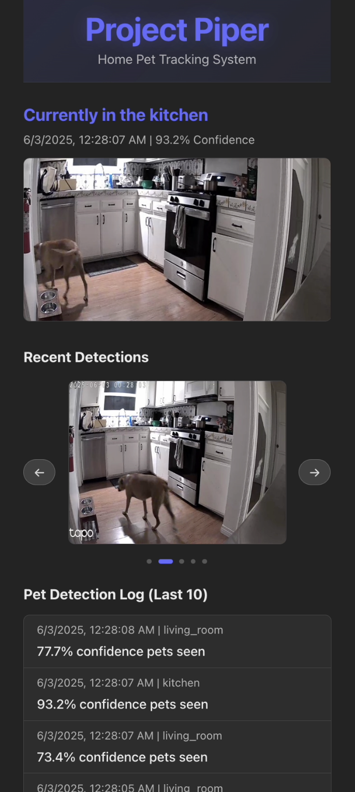

# Project Piper: Multi-Camera Home Dog Tracker

## Project Overview

Track the real-time movements of Piper (my dog) across multiple rooms and outdoor areas using low-cost RTSP cameras and [Roboflow Inference](https://inference.roboflow.com/) object detection.

## Key Inputs

| Source | Format | Notes |
|--------|--------|-------|
| RTSP camera feeds (Tapo C100) | rtsp://... | 4 total, each fixed in a room |
| Object detector | Roboflow model | Custom dog detector (fine-tuned) |
| Room metadata | JSON config | Maps camera ID → room |

## Core MVP Features

### Live Video Ingestion
- Connect to 4 RTSP streams simultaneously
- Sample frames in near real-time

### Dog Detection
- Run inference using Roboflow-hosted fine-tuned model
- Extract bounding box center + confidence
- Map detections to a room based on camera source
- Snapshot Piper's location for strong confidence predictions

### Web App (Real Time Display)
- Display current location of Piper
- Carousel of 5 most recent snapshots
- Activy stream of last 10 predictions

####


## Configuration

Before running the application, you need to set up two configuration files:

### 1. [MediaMTX](https://github.com/bluenviron/mediamtx) Proxy Configuration
Copy `mediamtx.sample.yml` to `mediamtx.yml` and configure your RTSP stream settings:
```bash
cp mediamtx.sample.yml mediamtx.yml
```

### 2. Environment Variables
Copy `.env.sample` to `.env` and configure your camera streams:
```bash
cp .env.sample .env
```
Edit `.env` to include your RTSP camera configuration. Example format:
```
CAM_PROXY_CONFIG=[
  {
    "name":"office",
    "stream_url":"rtsp://host.docker.internal:8554/office"
  },
  ...
]
```

## Setup & Running

### Start the Application
```bash
docker-compose up --build
```
Open the React web app at `http://localhost:5173`.

### Tear Down
```bash
docker-compose down
```